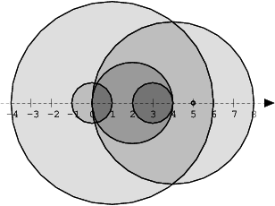

# Learning


## Lesson 1 Iterations

### 1. [Painless] [BinaryGap](https://app.codility.com/programmers/lessons/1-iterations/binary_gap/)

A *binary gap* within a positive integer N is any maximal sequence of consecutive zeros that is surrounded by ones at both ends in the binary representation of N.

For example, number 9 has binary representation `1001` and contains a binary gap of length 2. The number 529 has binary representation `1000010001` and contains two binary gaps: one of length 4 and one of length 3. The number 20 has binary representation `10100` and contains one binary gap of length 1. The number 15 has binary representation `1111` and has no binary gaps. The number 32 has binary representation `100000` and has no binary gaps.

Write a function:

> ```
> def solution(N)
> ```

that, given a positive integer N, returns the length of its longest binary gap. The function should return 0 if N doesn't contain a binary gap.

For example, given N = 1041 the function should return 5, because N has binary representation `10000010001` and so its longest binary gap is of length 5. Given N = 32 the function should return 0, because N has binary representation '100000' and thus no binary gaps.

Write an ***\*efficient\**** algorithm for the following assumptions:

> - N is an integer within the range [1..2,147,483,647].


#### Solution

> https://app.codility.com/demo/results/trainingY6RRWN-UXH/

````python
def solution(N):
    num = str(format(N, "b"))
    ones =[]
    for i, val in enumerate(num):
        if val == '1':
            ones.append(i)
    max_diff = 0
    for j in range(len(ones)-1):
        if ones[j+1] - ones[j]-1 > max_diff:
            max_diff = ones[j+1] - ones[j]-1
    return max_diff
````


## Lesson 2 Arrays

### 1. [Painless] [CyclicRotation](https://app.codility.com/programmers/lessons/2-arrays/cyclic_rotation/)

An array A consisting of N integers is given. Rotation of the array means that each element is shifted right by one index, and the last element of the array is moved to the first place. For example, the rotation of array A = [3, 8, 9, 7, 6] is [6, 3, 8, 9, 7] (elements are shifted right by one index and 6 is moved to the first place).

The goal is to rotate array A K times; that is, each element of A will be shifted to the right K times.

Write a function:

> ```
> def solution(A, K)
> ```

that, given an array A consisting of N integers and an integer K, returns the array A rotated K times.

For example, given

```
    A = [3, 8, 9, 7, 6]    K = 3
```

the function should return [9, 7, 6, 3, 8]. Three rotations were made:

```
    [3, 8, 9, 7, 6] -> [6, 3, 8, 9, 7]    [6, 3, 8, 9, 7] -> [7, 6, 3, 8, 9]    [7, 6, 3, 8, 9] -> [9, 7, 6, 3, 8]
```

For another example, given

```
    A = [0, 0, 0]    K = 1
```

the function should return [0, 0, 0]

Given

```
    A = [1, 2, 3, 4]    K = 4
```

the function should return [1, 2, 3, 4]

Assume that:

> - N and K are integers within the range [0..100];
> - each element of array A is an integer within the range [−1,000..1,000].

In your solution, focus on ***\*correctness\****. The performance of your solution will not be the focus of the assessment.

#### Solution

```python

```


### 2. [Painless] [OddOccurrencesInArray](https://app.codility.com/programmers/lessons/2-arrays/odd_occurrences_in_array/)

A non-empty array A consisting of N integers is given. The array contains an odd number of elements, and each element of the array can be paired with another element that has the same value, except for one element that is left unpaired.

For example, in array A such that:

```
  A[0] = 9  A[1] = 3  A[2] = 9  A[3] = 3  A[4] = 9  A[5] = 7  A[6] = 9
```

> - the elements at indexes 0 and 2 have value 9,
> - the elements at indexes 1 and 3 have value 3,
> - the elements at indexes 4 and 6 have value 9,
> - the element at index 5 has value 7 and is unpaired.

Write a function:

> ```
> def solution(A)
> ```

that, given an array A consisting of N integers fulfilling the above conditions, returns the value of the unpaired element.

For example, given array A such that:

```
  A[0] = 9  A[1] = 3  A[2] = 9  A[3] = 3  A[4] = 9  A[5] = 7  A[6] = 9
```

the function should return 7, as explained in the example above.

Write an ***\*efficient\**** algorithm for the following assumptions:

> - N is an odd integer within the range [1..1,000,000];
> - each element of array A is an integer within the range [1..1,000,000,000];
> - all but one of the values in A occur an even number of times.


#### Solution

```python
def solution(A):
    N = len(A)
    if N ==1:
        return A[0]
    A.sort()
    for i in range(0, len(A), 2):
        if i+1 == len(A):
            return A[i]
        if A[i] != A[i+1]:
            return A[i]
```


#### Other Solution

```python
def solution(A):
    compareList = []
    
    for num in A:
        flag = False
        for compare in compareList:
            if num == compare:
                compareList.remove(compare)
                flag = True
        if not flag:
            compareList.append(num)
    
    result = compareList.pop()
    return result
```


## Lesson 3 Time Complexity

### 1. [Painless] [FrogJmp](https://app.codility.com/programmers/lessons/3-time_complexity/frog_jmp/)

A small frog wants to get to the other side of the road. The frog is currently located at position X and wants to get to a position greater than or equal to Y. The small frog always jumps a fixed distance, D.

Count the minimal number of jumps that the small frog must perform to reach its target.

Write a function:

> ```
> def solution(X, Y, D)
> ```

that, given three integers X, Y and D, returns the minimal number of jumps from position X to a position equal to or greater than Y.

For example, given:

```
  X = 10  Y = 85  D = 30
```

the function should return 3, because the frog will be positioned as follows:

> - after the first jump, at position 10 + 30 = 40
> - after the second jump, at position 10 + 30 + 30 = 70
> - after the third jump, at position 10 + 30 + 30 + 30 = 100

Write an ***\*efficient\**** algorithm for the following assumptions:

> - X, Y and D are integers within the range [1..1,000,000,000];
> - X ≤ Y.


### 2. [Painless] [PermMissingElem](https://app.codility.com/programmers/lessons/3-time_complexity/perm_missing_elem/)

An array A consisting of N different integers is given. The array contains integers in the range [1..(N + 1)], which means that exactly one element is missing.

Your goal is to find that missing element.

Write a function:

> ```
> def solution(A)
> ```

that, given an array A, returns the value of the missing element.

For example, given array A such that:

```
  A[0] = 2  A[1] = 3  A[2] = 1  A[3] = 5
```

the function should return 4, as it is the missing element.

Write an ***\*efficient\**** algorithm for the following assumptions:

> - N is an integer within the range [0..100,000];
> - the elements of A are all distinct;
> - each element of array A is an integer within the range [1..(N + 1)].

#### Solution

```python

```


### 3. [Painless] [TapeEquilibrium](https://app.codility.com/programmers/lessons/3-time_complexity/tape_equilibrium/)

A non-empty array A consisting of N integers is given. Array A represents numbers on a tape.

Any integer P, such that 0 < P < N, splits this tape into two non-empty parts: A[0], A[1], ..., A[P − 1] and A[P], A[P + 1], ..., A[N − 1].

The *difference* between the two parts is the value of: |(A[0] + A[1] + ... + A[P − 1]) − (A[P] + A[P + 1] + ... + A[N − 1])|

In other words, it is the absolute difference between the sum of the first part and the sum of the second part.

For example, consider array A such that:

```
  A[0] = 3  A[1] = 1  A[2] = 2  A[3] = 4  A[4] = 3
```

We can split this tape in four places:

> - P = 1, difference = |3 − 10| = 7
> - P = 2, difference = |4 − 9| = 5
> - P = 3, difference = |6 − 7| = 1
> - P = 4, difference = |10 − 3| = 7

Write a function:

> ```
> def solution(A)
> ```

that, given a non-empty array A of N integers, returns the minimal difference that can be achieved.

For example, given:

```
  A[0] = 3  A[1] = 1  A[2] = 2  A[3] = 4  A[4] = 3
```

the function should return 1, as explained above.

Write an ***\*efficient\**** algorithm for the following assumptions:

> - N is an integer within the range [2..100,000];
> - each element of array A is an integer within the range [−1,000..1,000].


#### Solution

```python
def solution(A):
    min_diff = 1000*len(A)+1
    former = 0
    for i in range(len(A)-1):
        if abs(sum(A)-former-2*A[i]) <= min_diff:
            min_diff = abs(sum(A)-former-2*A[i])
        former += 2*A[i]
    return min_diff
```


## Lesson 4 Counting Elements

### 1. [Painless] [FrogRiverOne](https://app.codility.com/programmers/lessons/4-counting_elements/frog_river_one/)

A small frog wants to get to the other side of a river. The frog is initially located on one bank of the river (position 0) and wants to get to the opposite bank (position X+1). Leaves fall from a tree onto the surface of the river.

You are given an array A consisting of N integers representing the falling leaves. A[K] represents the position where one leaf falls at time K, measured in seconds.

The goal is to find the earliest time when the frog can jump to the other side of the river. The frog can cross only when leaves appear at every position across the river from 1 to X (that is, we want to find the earliest moment when all the positions from 1 to X are covered by leaves). You may assume that the speed of the current in the river is negligibly small, i.e. the leaves do not change their positions once they fall in the river.

For example, you are given integer X = 5 and array A such that:

```
  A[0] = 1  A[1] = 3  A[2] = 1  A[3] = 4  A[4] = 2  A[5] = 3  A[6] = 5  A[7] = 4
```

In second 6, a leaf falls into position 5. This is the earliest time when leaves appear in every position across the river.

Write a function:

> ```
> def solution(X, A)
> ```

that, given a non-empty array A consisting of N integers and integer X, returns the earliest time when the frog can jump to the other side of the river.

If the frog is never able to jump to the other side of the river, the function should return −1.

For example, given X = 5 and array A such that:

```
  A[0] = 1  A[1] = 3  A[2] = 1  A[3] = 4  A[4] = 2  A[5] = 3  A[6] = 5  A[7] = 4
```

the function should return 6, as explained above.

Write an ***\*efficient\**** algorithm for the following assumptions:

> - N and X are integers within the range [1..100,000];
> - each element of array A is an integer within the range [1..X].


#### Solution

```python

```


### 2. [Respectable] [MaxCounters](https://app.codility.com/programmers/lessons/4-counting_elements/max_counters/)

#### Timeout Solution

```python
def solution(N, A):
    count = [0]*N
    for i in range(len(A)):
        if 1 <= A[i]<= N:
            count[A[i]-1] += 1
        else:
            count = [max(count)]*N
    return count
```


### 3. [Respectable] [MissingInteger](https://app.codility.com/programmers/lessons/4-counting_elements/missing_integer/)


#### Solution

> https://app.codility.com/demo/results/training5PGQY7-282/

```python
def solution(A):
    A.sort()
    min_num = 1
    for a in A:
        if a == min_num:
            min_num += 1
    return min_num
```

### 4. [Painless] [PermCheck](https://app.codility.com/programmers/lessons/4-counting_elements/perm_check/)

A non-empty array A consisting of N integers is given.

A *permutation* is a sequence containing each element from 1 to N once, and only once.

For example, array A such that:

```
    A[0] = 4    A[1] = 1    A[2] = 3    A[3] = 2
```

is a permutation, but array A such that:

```
    A[0] = 4    A[1] = 1    A[2] = 3
```

is not a permutation, because value 2 is missing.

The goal is to check whether array A is a permutation.

Write a function:

> ```
> def solution(A)
> ```

that, given an array A, returns 1 if array A is a permutation and 0 if it is not.

For example, given array A such that:

```
    A[0] = 4    A[1] = 1    A[2] = 3    A[3] = 2
```

the function should return 1.

Given array A such that:

```
    A[0] = 4    A[1] = 1    A[2] = 3
```

the function should return 0.

Write an ***\*efficient\**** algorithm for the following assumptions:

> - N is an integer within the range [1..100,000];
> - each element of array A is an integer within the range [1..1,000,000,000].


#### Solution

```python
def solution(A):
    if len(A) != max(A):
        return 0
    V = [0]*(max(A)+1)
    for i in range(len(A)):
        if not V[A[i]]:
            V[A[i]] += 1
        else:
            return 0
    if V == [0]+[1]*len(A):
        return 1
    return 0
```


## Lesson 5 Prefix Sums

### 1. [Respectable] [CountDiv](https://app.codility.com/programmers/lessons/5-prefix_sums/count_div/)

Write a function:

> ```
> def solution(A, B, K)
> ```

that, given three integers A, B and K, returns the number of integers within the range [A..B] that are divisible by K, i.e.:

> { i : A ≤ i ≤ B, i **mod** K = 0 }

For example, for A = 6, B = 11 and K = 2, your function should return 3, because there are three numbers divisible by 2 within the range [6..11], namely 6, 8 and 10.

Write an ***\*efficient\**** algorithm for the following assumptions:

> - A and B are integers within the range [0..2,000,000,000];
> - K is an integer within the range [1..2,000,000,000];
> - A ≤ B.

#### Solution

```python
def solution(A, B, K):
    if A%K:
        return (B//K)-(A//K)
    else:
        return (B//K)-(A//K)+1
```


### 2. [Respectable] [GenomicRangeQuery](https://app.codility.com/programmers/lessons/5-prefix_sums/genomic_range_query/)

A DNA sequence can be represented as a string consisting of the letters `A`, `C`, `G` and `T`, which correspond to the types of successive nucleotides in the sequence. Each nucleotide has an *impact factor*, which is an integer. Nucleotides of types `A`, `C`, `G` and `T` have impact factors of 1, 2, 3 and 4, respectively. You are going to answer several queries of the form: What is the minimal impact factor of nucleotides contained in a particular part of the given DNA sequence?

The DNA sequence is given as a non-empty string S = `S[0]S[1]...S[N-1]` consisting of N characters. There are M queries, which are given in non-empty arrays P and Q, each consisting of M integers. The K-th query (0 ≤ K < M) requires you to find the minimal impact factor of nucleotides contained in the DNA sequence between positions P[K] and Q[K] (inclusive).

For example, consider string S = `CAGCCTA` and arrays P, Q such that:

```
    P[0] = 2    Q[0] = 4    P[1] = 5    Q[1] = 5    P[2] = 0    Q[2] = 6
```

The answers to these M = 3 queries are as follows:

> - The part of the DNA between positions 2 and 4 contains nucleotides `G` and `C` (twice), whose impact factors are 3 and 2 respectively, so the answer is 2.
> - The part between positions 5 and 5 contains a single nucleotide `T`, whose impact factor is 4, so the answer is 4.
> - The part between positions 0 and 6 (the whole string) contains all nucleotides, in particular nucleotide `A` whose impact factor is 1, so the answer is 1.

Write a function:

> ```
> def solution(S, P, Q)
> ```

that, given a non-empty string S consisting of N characters and two non-empty arrays P and Q consisting of M integers, returns an array consisting of M integers specifying the consecutive answers to all queries.

Result array should be returned as an array of integers.

For example, given the string S = `CAGCCTA` and arrays P, Q such that:

```
    P[0] = 2    Q[0] = 4    P[1] = 5    Q[1] = 5    P[2] = 0    Q[2] = 6
```

the function should return the values [2, 4, 1], as explained above.

Write an ***\*efficient\**** algorithm for the following assumptions:

> - N is an integer within the range [1..100,000];
> - M is an integer within the range [1..50,000];
> - each element of arrays P, Q is an integer within the range [0..N − 1];
> - P[K] ≤ Q[K], where 0 ≤ K < M;
> - string S consists only of upper-case English letters `A, C, G, T`.


#### Solution

```python
def solution(S, P, Q):
    A = [0]*len(P)
    for i in range(len(P)):
        gene = S[P[i]:Q[i]+1]
        if 'A' in gene: A[i] = 1
        elif 'C' in gene: A[i] = 2
        elif 'G' in gene: A[i] = 3
        elif 'T' in gene: A[i] = 4
    return A
```


### 3. [Respectable] [MinAvgTwoSlice](https://app.codility.com/programmers/lessons/5-prefix_sums/min_avg_two_slice/)

A non-empty array A consisting of N integers is given. A pair of integers (P, Q), such that 0 ≤ P < Q < N, is called a *slice* of array A (notice that the slice contains at least two elements). The *average* of a slice (P, Q) is the sum of A[P] + A[P + 1] + ... + A[Q] divided by the length of the slice. To be precise, the average equals (A[P] + A[P + 1] + ... + A[Q]) / (Q − P + 1).

For example, array A such that:

```
    A[0] = 4    A[1] = 2    A[2] = 2    A[3] = 5    A[4] = 1    A[5] = 5    A[6] = 8
```

contains the following example slices:

> - slice (1, 2), whose average is (2 + 2) / 2 = 2;
> - slice (3, 4), whose average is (5 + 1) / 2 = 3;
> - slice (1, 4), whose average is (2 + 2 + 5 + 1) / 4 = 2.5.

The goal is to find the starting position of a slice whose average is minimal.

Write a function:

> ```
> def solution(A)
> ```

that, given a non-empty array A consisting of N integers, returns the starting position of the slice with the minimal average. If there is more than one slice with a minimal average, you should return the smallest starting position of such a slice.

For example, given array A such that:

```
    A[0] = 4    A[1] = 2    A[2] = 2    A[3] = 5    A[4] = 1    A[5] = 5    A[6] = 8
```

the function should return 1, as explained above.

Write an ***\*efficient\**** algorithm for the following assumptions:

> - N is an integer within the range [2..100,000];
> - each element of array A is an integer within the range [−10,000..10,000].


#### Solution

```python
def solution(A):
    if len(A) == 2: return 0
    min_avg = sum(A[0:2])/2
    start_idx = 0
    for i in range(len(A)-1):
        if i+2 < len(A) and sum(A[i:i+3])/3 < min_avg:
            start_idx = i
            min_avg = sum(A[i:i+3])/3
        if sum(A[i:i+2])/2 < min_avg:
            start_idx = i
            min_avg = sum(A[i:i+2])/2
    return start_idx
```


### 4. [Painless] [PassingCars](https://app.codility.com/programmers/lessons/5-prefix_sums/passing_cars/)

A non-empty array A consisting of N integers is given. The consecutive elements of array A represent consecutive cars on a road.

Array A contains only 0s and/or 1s:

> - 0 represents a car traveling east,
> - 1 represents a car traveling west.

The goal is to count passing cars. We say that a pair of cars (P, Q), where 0 ≤ P < Q < N, is passing when P is traveling to the east and Q is traveling to the west.

For example, consider array A such that:

```
  A[0] = 0  A[1] = 1  A[2] = 0  A[3] = 1  A[4] = 1
```

We have five pairs of passing cars: (0, 1), (0, 3), (0, 4), (2, 3), (2, 4).

Write a function:

> ```
> def solution(A)
> ```

that, given a non-empty array A of N integers, returns the number of pairs of passing cars.

The function should return −1 if the number of pairs of passing cars exceeds 1,000,000,000.

For example, given:

```
  A[0] = 0  A[1] = 1  A[2] = 0  A[3] = 1  A[4] = 1
```

the function should return 5, as explained above.

Write an ***\*efficient\**** algorithm for the following assumptions:

> - N is an integer within the range [1..100,000];
> - each element of array A is an integer that can have one of the following values: 0, 1.


#### Solution

```python

```


## Lesson 6 Sorting

### 1. [Painless] [Distinct](https://app.codility.com/programmers/lessons/6-sorting/distinct/)

Write a function

> ```
> def solution(A)
> ```

that, given an array A consisting of N integers, returns the number of distinct values in array A.

For example, given array A consisting of six elements such that:

```
 A[0] = 2    A[1] = 1    A[2] = 1 A[3] = 2    A[4] = 3    A[5] = 1
```

the function should return 3, because there are 3 distinct values appearing in array A, namely 1, 2 and 3.

Write an ***\*efficient\**** algorithm for the following assumptions:

> - N is an integer within the range [0..100,000];
> - each element of array A is an integer within the range [−1,000,000..1,000,000].


#### Solution

```python

```


### 2. [Painless] [MaxProductOfThree](https://app.codility.com/programmers/lessons/6-sorting/max_product_of_three/)

A non-empty array A consisting of N integers is given. The *product* of triplet (P, Q, R) equates to A[P] * A[Q] * A[R] (0 ≤ P < Q < R < N).

For example, array A such that:

```
  A[0] = -3  A[1] = 1  A[2] = 2  A[3] = -2  A[4] = 5  A[5] = 6
```

contains the following example triplets:

> - (0, 1, 2), product is −3 * 1 * 2 = −6
> - (1, 2, 4), product is 1 * 2 * 5 = 10
> - (2, 4, 5), product is 2 * 5 * 6 = 60

Your goal is to find the maximal product of any triplet.

Write a function:

> ```
> def solution(A)
> ```

that, given a non-empty array A, returns the value of the maximal product of any triplet.

For example, given array A such that:

```
  A[0] = -3  A[1] = 1  A[2] = 2  A[3] = -2  A[4] = 5  A[5] = 6
```

the function should return 60, as the product of triplet (2, 4, 5) is maximal.

Write an ***\*efficient\**** algorithm for the following assumptions:

> - N is an integer within the range [3..100,000];
> - each element of array A is an integer within the range [−1,000..1,000].

#### Solution

```python
def solution(A):
    A.sort(reverse=True)
    return max(A[0]*A[1]*A[2], A[0]*A[-1]*A[-2])
```


### Timeout Solution

```python
def solution(A):
		def combi(n, s):
        nonlocal max_product, P, A
        if n == 3:
            prod = 1
            for j in P:
                prod *= A[j]
            if prod > max_product:
                max_product = prod
            return 
        else:
            for i in range(s, len(A)):
                P[n] = i
                combi(n+1, i+1)
    max_product = -10**9
    P = [0]*3
    combi(0, 0)
		return max_product
```


### 3. [Respectable] [NumberOfDiscIntersections](https://app.codility.com/programmers/lessons/6-sorting/number_of_disc_intersections/)

We draw N discs on a plane. The discs are numbered from 0 to N − 1. An array A of N non-negative integers, specifying the radiuses of the discs, is given. The J-th disc is drawn with its center at (J, 0) and radius A[J].

We say that the J-th disc and K-th disc intersect if J ≠ K and the J-th and K-th discs have at least one common point (assuming that the discs contain their borders).

The figure below shows discs drawn for N = 6 and A as follows:

```
  A[0] = 1  A[1] = 5  A[2] = 2  A[3] = 1  A[4] = 4  A[5] = 0
```



There are eleven (unordered) pairs of discs that intersect, namely:

> - discs 1 and 4 intersect, and both intersect with all the other discs;
> - disc 2 also intersects with discs 0 and 3.

Write a function:

> ```
> def solution(A)
> ```

that, given an array A describing N discs as explained above, returns the number of (unordered) pairs of intersecting discs. The function should return −1 if the number of intersecting pairs exceeds 10,000,000.

Given array A shown above, the function should return 11, as explained above.

Write an ***\*efficient\**** algorithm for the following assumptions:

> - N is an integer within the range [0..100,000];
> - each element of array A is an integer within the range [0..2,147,483,647].


#### Solution

```python
def solution(A):
    points = []
    for i, r in  enumerate(A):
        points.append([i-r, -1])
        points.append([i+r, 1])

    points.sort()
    intersection = 0
    interval = 0
    for i, v in enumerate(points):
        if v[1] == 1:
            interval -= 1 # 원이 하나 완성되어 겹치는 원 개수 줄어들음 
        elif v[1] == -1:
            intersection += interval
            interval += 1  # 겹칠 수 있는 원 하나 증가 
    if intersection > 10000000:
        return -1
    return intersection
```


### 4. [Painless] [Triangle](https://app.codility.com/programmers/lessons/6-sorting/triangle/)

An array A consisting of N integers is given. A triplet (P, Q, R) is *triangular* if 0 ≤ P < Q < R < N and:

> - A[P] + A[Q] > A[R],
> - A[Q] + A[R] > A[P],
> - A[R] + A[P] > A[Q].

For example, consider array A such that:

```
  A[0] = 10    A[1] = 2    A[2] = 5  A[3] = 1     A[4] = 8    A[5] = 20
```

Triplet (0, 2, 4) is triangular.

Write a function:

> ```
> def solution(A)
> ```

that, given an array A consisting of N integers, returns 1 if there exists a triangular triplet for this array and returns 0 otherwise.

For example, given array A such that:

```
  A[0] = 10    A[1] = 2    A[2] = 5  A[3] = 1     A[4] = 8    A[5] = 20
```

the function should return 1, as explained above. Given array A such that:

```
  A[0] = 10    A[1] = 50    A[2] = 5  A[3] = 1
```

the function should return 0.

Write an ***\*efficient\**** algorithm for the following assumptions:

> - N is an integer within the range [0..100,000];
> - each element of array A is an integer within the range [−2,147,483,648..2,147,483,647].


#### Solution

```python

```


## Lesson 7 Stacks and Queues

### 1. [Painless] [Brackets](https://app.codility.com/programmers/lessons/7-stacks_and_queues/brackets/)

A string S consisting of N characters is considered to be *properly nested* if any of the following conditions is true:

> - S is empty;
> - S has the form "`(U)`" or "`[U]`" or "`{U}`" where U is a properly nested string;
> - S has the form "`VW`" where V and W are properly nested strings.

For example, the string "`{[()()]}`" is properly nested but "`([)()]`" is not.

Write a function:

> ```
> def solution(S)
> ```

that, given a string S consisting of N characters, returns 1 if S is properly nested and 0 otherwise.

For example, given S = "`{[()()]}`", the function should return 1 and given S = "`([)()]`", the function should return 0, as explained above.

Write an ***\*efficient\**** algorithm for the following assumptions:

> - N is an integer within the range [0..200,000];
> - string S consists only of the following characters: "`(`", "`{`", "`[`", "`]`", "`}`" and/or "`)`".


#### Solution

```python

```


### 2. [Painless] [Fish](https://app.codility.com/programmers/lessons/7-stacks_and_queues/fish/)

You are given two non-empty arrays A and B consisting of N integers. Arrays A and B represent N voracious fish in a river, ordered downstream along the flow of the river.

The fish are numbered from 0 to N − 1. If P and Q are two fish and P < Q, then fish P is initially upstream of fish Q. Initially, each fish has a unique position.

Fish number P is represented by A[P] and B[P]. Array A contains the sizes of the fish. All its elements are unique. Array B contains the directions of the fish. It contains only 0s and/or 1s, where:

> - 0 represents a fish flowing upstream,
> - 1 represents a fish flowing downstream.

If two fish move in opposite directions and there are no other (living) fish between them, they will eventually meet each other. Then only one fish can stay alive − the larger fish eats the smaller one. More precisely, we say that two fish P and Q meet each other when P < Q, B[P] = 1 and B[Q] = 0, and there are no living fish between them. After they meet:

> - If A[P] > A[Q] then P eats Q, and P will still be flowing downstream,
> - If A[Q] > A[P] then Q eats P, and Q will still be flowing upstream.

We assume that all the fish are flowing at the same speed. That is, fish moving in the same direction never meet. The goal is to calculate the number of fish that will stay alive.

For example, consider arrays A and B such that:

```
  A[0] = 4    B[0] = 0  A[1] = 3    B[1] = 1  A[2] = 2    B[2] = 0  A[3] = 1    B[3] = 0  A[4] = 5    B[4] = 0
```

Initially all the fish are alive and all except fish number 1 are moving upstream. Fish number 1 meets fish number 2 and eats it, then it meets fish number 3 and eats it too. Finally, it meets fish number 4 and is eaten by it. The remaining two fish, number 0 and 4, never meet and therefore stay alive.

Write a function:

> ```
> def solution(A, B)
> ```

that, given two non-empty arrays A and B consisting of N integers, returns the number of fish that will stay alive.

For example, given the arrays shown above, the function should return 2, as explained above.

Write an ***\*efficient\**** algorithm for the following assumptions:

> - N is an integer within the range [1..100,000];
> - each element of array A is an integer within the range [0..1,000,000,000];
> - each element of array B is an integer that can have one of the following values: 0, 1;
> - the elements of A are all distinct.


#### Solution

```python
def solution(A, B):
    N = len(A)
    stack = []
    down = 0
    for size, dir in zip(A,B):
        if dir == 1:  # 아래로 가는 물고기이면 저장 
            stack.append([size, dir])
        elif dir == 0: # 위로 가는 물고기이면 
            while stack: # 아래로 가는 물고기들 탐색 
                fsize, fdir = stack[-1] # 앞에 있는 아래로 가는 물고기
                if fsize > size:        # 앞에 있는 물고기가 더 크면 존재 
                    break
                else:                   # 위로 가는 물고기가 더 크면 잡아먹힘
                    stack.pop()
            if not stack:               # 아래로 가는 물고기가 더 이상 없으면 
                down += 1
    return  len(stack)+down 
```


### 3. [Painless] [Nesting](https://app.codility.com/programmers/lessons/7-stacks_and_queues/nesting/)

A string S consisting of N characters is called *properly nested* if:

> - S is empty;
> - S has the form "`(U)`" where U is a properly nested string;
> - S has the form "`VW`" where V and W are properly nested strings.

For example, string "`(()(())())`" is properly nested but string "`())`" isn't.

Write a function:

> ```
> def solution(S)
> ```

that, given a string S consisting of N characters, returns 1 if string S is properly nested and 0 otherwise.

For example, given S = "`(()(())())`", the function should return 1 and given S = "`())`", the function should return 0, as explained above.

Write an ***\*efficient\**** algorithm for the following assumptions:

> - N is an integer within the range [0..1,000,000];
> - string S consists only of the characters "`(`" and/or "`)`".


#### Solution

```python
def solution(S):
    stack = []
    for s in S:
        if s == '(':
            stack.append(s)
        elif not stack:
            return 0
        elif stack[-1] == '(':
                stack.pop()
    if stack:
        return 0
    return 1
```


### 4. [Painless] [StoneWall](https://app.codility.com/programmers/lessons/7-stacks_and_queues/stone_wall/)

You are going to build a stone wall. The wall should be straight and N meters long, and its thickness should be constant; however, it should have different heights in different places. The height of the wall is specified by an array H of N positive integers. H[I] is the height of the wall from I to I+1 meters to the right of its left end. In particular, H[0] is the height of the wall's left end and H[N−1] is the height of the wall's right end.

The wall should be built of cuboid stone blocks (that is, all sides of such blocks are rectangular). Your task is to compute the minimum number of blocks needed to build the wall.

Write a function:

> ```
> def solution(H)
> ```

that, given an array H of N positive integers specifying the height of the wall, returns the minimum number of blocks needed to build it.

For example, given array H containing N = 9 integers:

```
  H[0] = 8    H[1] = 8    H[2] = 5  H[3] = 7    H[4] = 9    H[5] = 8  H[6] = 7    H[7] = 4    H[8] = 8
```

the function should return 7. The figure shows one possible arrangement of seven blocks.


Write an ***\*efficient\**** algorithm for the following assumptions:

> - N is an integer within the range [1..100,000];
> - each element of array H is an integer within the range [1..1,000,000,000].


#### Solution

```python
def solution(H):
    cnt = 0
    stack = []
    for i in range(len(H)):
        while stack and stack[-1] > H[i]:
            stack.pop()
        if not stack or stack[-1] < H[i]:
            cnt += 1
            stack.append(H[i])
    return cnt
```


## Lesson 8 Leader

### 1. [Painless] [Dominator](https://app.codility.com/programmers/lessons/8-leader/dominator/)

An array A consisting of N integers is given. The *dominator* of array A is the value that occurs in more than half of the elements of A.

For example, consider array A such that

```
 A[0] = 3    A[1] = 4    A[2] =  3 A[3] = 2    A[4] = 3    A[5] = -1 A[6] = 3    A[7] = 3
```

The dominator of A is 3 because it occurs in 5 out of 8 elements of A (namely in those with indices 0, 2, 4, 6 and 7) and 5 is more than a half of 8.

Write a function

> ```
> def solution(A)
> ```

that, given an array A consisting of N integers, returns index of any element of array A in which the dominator of A occurs. The function should return −1 if array A does not have a dominator.

For example, given array A such that

```
 A[0] = 3    A[1] = 4    A[2] =  3 A[3] = 2    A[4] = 3    A[5] = -1 A[6] = 3    A[7] = 3
```

the function may return 0, 2, 4, 6 or 7, as explained above.

Write an ***\*efficient\**** algorithm for the following assumptions:

> - N is an integer within the range [0..100,000];
> - each element of array A is an integer within the range [−2,147,483,648..2,147,483,647].


#### Solution

```python

```


## Lesson 9 Maximum Slice Problem
### 2. [Painless] [MaxProfit](https://app.codility.com/programmers/lessons/9-maximum_slice_problem/max_profit/)

An array A consisting of N integers is given. It contains daily prices of a stock share for a period of N consecutive days. If a single share was bought on day P and sold on day Q, where 0 ≤ P ≤ Q < N, then the *profit* of such transaction is equal to A[Q] − A[P], provided that A[Q] ≥ A[P]. Otherwise, the transaction brings *loss* of A[P] − A[Q].

For example, consider the following array A consisting of six elements such that:

```
  A[0] = 23171  A[1] = 21011  A[2] = 21123  A[3] = 21366  A[4] = 21013  A[5] = 21367
```

If a share was bought on day 0 and sold on day 2, a loss of 2048 would occur because A[2] − A[0] = 21123 − 23171 = −2048. If a share was bought on day 4 and sold on day 5, a profit of 354 would occur because A[5] − A[4] = 21367 − 21013 = 354. Maximum possible profit was 356. It would occur if a share was bought on day 1 and sold on day 5.

Write a function,

> ```
> def solution(A)
> ```

that, given an array A consisting of N integers containing daily prices of a stock share for a period of N consecutive days, returns the maximum possible profit from one transaction during this period. The function should return 0 if it was impossible to gain any profit.

For example, given array A consisting of six elements such that:

```
  A[0] = 23171  A[1] = 21011  A[2] = 21123  A[3] = 21366  A[4] = 21013  A[5] = 21367
```

the function should return 356, as explained above.

Write an ***\*efficient\**** algorithm for the following assumptions:

> - N is an integer within the range [0..400,000];
> - each element of array A is an integer within the range [0..200,000].

#### Summary

* 시작 인덱스와 끝 인덱싀의 값 차이를 비교하여 그 중 최댓값 구함 |A[i]-A[j]|

#### Solution

>  https://app.codility.com/demo/results/trainingF7VPGV-UNR/

```python

def solution(A):
    if len(A) < 2:    # 예외처리 안하면 정답률 88%
        return 0
    min_price = A[0]
    max_profit = 0
    for price in A:
        profit = price - min_price
        if profit > max_profit:
            max_profit = profit
        if min_price > price:
            min_price = price 
    return max_profit
```


### 3. [Painless] [MaxSliceSum](https://app.codility.com/programmers/lessons/9-maximum_slice_problem/max_slice_sum/)

A non-empty array A consisting of N integers is given. A pair of integers (P, Q), such that 0 ≤ P ≤ Q < N, is called a *slice* of array A. The *sum* of a slice (P, Q) is the total of A[P] + A[P+1] + ... + A[Q].

Write a function:

> ```
> def solution(A)
> ```

that, given an array A consisting of N integers, returns the maximum sum of any slice of A.

For example, given array A such that:

```
A[0] = 3  A[1] = 2  A[2] = -6 A[3] = 4  A[4] = 0
```

the function should return 5 because:

> - (3, 4) is a slice of A that has sum 4,
> - (2, 2) is a slice of A that has sum −6,
> - (0, 1) is a slice of A that has sum 5,
> - no other slice of A has sum greater than (0, 1).

Write an ***\*efficient\**** algorithm for the following assumptions:

> - N is an integer within the range [1..1,000,000];
> - each element of array A is an integer within the range [−1,000,000..1,000,000];
> - the result will be an integer within the range [−2,147,483,648..2,147,483,647].

#### Summary

* 특정 범위의 숫자들의 합 중 최댓값 찾기

#### Solution

> https://app.codility.com/demo/results/trainingVZA4GW-4YX/


```python
def solution(A):
    if len(A) == 1: return A[0]   # 없어도 OK
    max_sum = sum(A)  # 합들 중 최댓값 
    current = 0       # 현재 합
    for num in A:
        max_sum = max(max_sum, current+num)  # 현재 더해질 값과, 최대합 중 더 큰 값으로 업데이트 
        current = max(0, current+num)        # 새로운 값이 더해졌을 떼 0보다 크면 업데이트, 아니면 0부터 다시 확인 
    return max_sum
```


## Lesson 10 Prime and composite numbers

### 1. [Painless] [CountFactors](https://app.codility.com/programmers/lessons/10-prime_and_composite_numbers/count_factors/)

A positive integer D is a *factor* of a positive integer N if there exists an integer M such that N = D * M.

For example, 6 is a factor of 24, because M = 4 satisfies the above condition (24 = 6 * 4).

Write a function:

> ```
> def solution(N)
> ```

that, given a positive integer N, returns the number of its factors.

For example, given N = 24, the function should return 8, because 24 has 8 factors, namely 1, 2, 3, 4, 6, 8, 12, 24. There are no other factors of 24.

Write an ***\*efficient\**** algorithm for the following assumptions:

> - N is an integer within the range [1..2,147,483,647].


#### Solution

```python

```


## Lesson 11


## Lesson 12


## Lesson 13


## Lesson 14


## Lesson 15


## Lesson 16 Greedy algorithms

### 1. [Painless] [MaxNonoverlappingSegments](https://app.codility.com/programmers/lessons/16-greedy_algorithms/max_nonoverlapping_segments/)

Located on a line are N segments, numbered from 0 to N − 1, whose positions are given in arrays A and B. For each I (0 ≤ I < N) the position of segment I is from A[I] to B[I] (inclusive). The segments are sorted by their ends, which means that B[K] ≤ B[K + 1] for K such that 0 ≤ K < N − 1.

Two segments I and J, such that I ≠ J, are *overlapping* if they share at least one common point. In other words, A[I] ≤ A[J] ≤ B[I] or A[J] ≤ A[I] ≤ B[J].

We say that the set of segments is *non-overlapping* if it contains no two overlapping segments. The goal is to find the size of a non-overlapping set containing the maximal number of segments.

For example, consider arrays A, B such that:

```
    A[0] = 1    B[0] = 5    A[1] = 3    B[1] = 6    A[2] = 7    B[2] = 8    A[3] = 9    B[3] = 9    A[4] = 9    B[4] = 10
```

The segments are shown in the figure below.


The size of a non-overlapping set containing a maximal number of segments is 3. For example, possible sets are {0, 2, 3}, {0, 2, 4}, {1, 2, 3} or {1, 2, 4}. There is no non-overlapping set with four segments.

Write a function:

> ```
> def solution(A, B)
> ```

that, given two arrays A and B consisting of N integers, returns the size of a non-overlapping set containing a maximal number of segments.

For example, given arrays A, B shown above, the function should return 3, as explained above.

Write an ***\*efficient\**** algorithm for the following assumptions:

> - N is an integer within the range [0..30,000];
> - each element of arrays A, B is an integer within the range [0..1,000,000,000];
> - A[I] ≤ B[I], for each I (0 ≤ I < N);
> - B[K] ≤ B[K + 1], for each K (0 ≤ K < N − 1).


#### Solution

```python

```


### 2. [Painless] [TieRopes](https://app.codility.com/programmers/lessons/16-greedy_algorithms/tie_ropes/)

here are N ropes numbered from 0 to N − 1, whose lengths are given in an array A, lying on the floor in a line. For each I (0 ≤ I < N), the length of rope I on the line is A[I].

We say that two ropes I and I + 1 are *adjacent*. Two adjacent ropes can be tied together with a knot, and the length of the tied rope is the sum of lengths of both ropes. The resulting new rope can then be tied again.

For a given integer K, the goal is to tie the ropes in such a way that the number of ropes whose length is greater than or equal to K is maximal.

For example, consider K = 4 and array A such that:

```
    A[0] = 1    A[1] = 2    A[2] = 3    A[3] = 4    A[4] = 1    A[5] = 1    A[6] = 3
```

The ropes are shown in the figure below.


We can tie:

> - rope 1 with rope 2 to produce a rope of length A[1] + A[2] = 5;
> - rope 4 with rope 5 with rope 6 to produce a rope of length A[4] + A[5] + A[6] = 5.

After that, there will be three ropes whose lengths are greater than or equal to K = 4. It is not possible to produce four such ropes.

Write a function:

> ```
> def solution(K, A)
> ```

that, given an integer K and a non-empty array A of N integers, returns the maximum number of ropes of length greater than or equal to K that can be created.

For example, given K = 4 and array A such that:

```
    A[0] = 1    A[1] = 2    A[2] = 3    A[3] = 4    A[4] = 1    A[5] = 1    A[6] = 3
```

the function should return 3, as explained above.

Write an ***\*efficient\**** algorithm for the following assumptions:

> - N is an integer within the range [1..100,000];
> - K is an integer within the range [1..1,000,000,000];
> - each element of array A is an integer within the range [1..1,000,000,000].


#### Solution

```python

```


## Lesson 17


